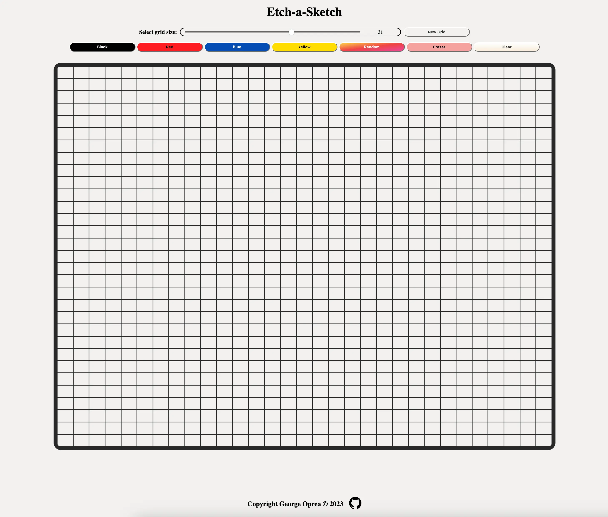

# [Etch-a-sketch](https://georgeoprea1.github.io/etch-a-sketch./)

Created as part of The Odin Project curriculum.

## Features

- Create your own pixel art.
- Create a grid size up to 60 x 60.
- Choose any color from the input, press the pick button and start drawing.
- Random button always selects a different color.
- Responsive design.

## Technologies

- JavaScript
- CSS
- HTML

## Tools

- Visual Studio Code
- Linux terminal
- Git and GitHub
- ESLint + Airbnb JavaScript Style Guide
